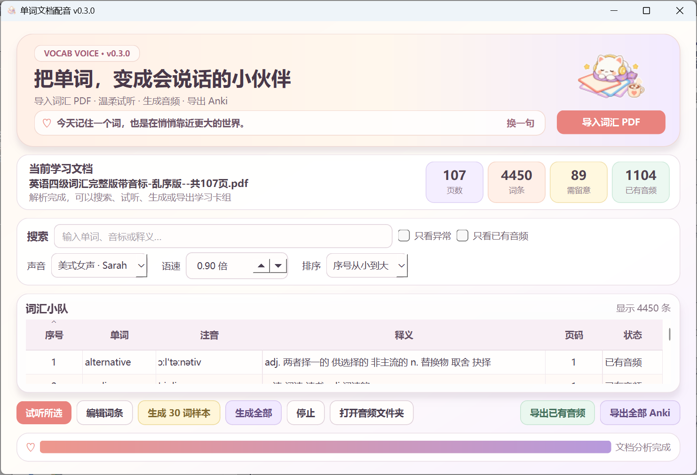

# v0.3.x 动漫治愈风主界面

## 目标

在不改变 PDF 提取、语音生成、音频缓存和 Anki 导出的前提下，把桌面界面更新为适合语言学习者的原创动漫治愈风，让长时间背词的过程更轻松，同时保持所有关键操作清楚、可靠。

## 视觉语言

- 奶油白作为大面积背景，珊瑚粉用于主操作，薰衣草紫用于次操作，薄荷绿和暖黄色用于完成与提醒状态。
- 主区域使用圆角卡片、轻阴影和低对比边框；数据表保持高可读性，不把装饰放进词条内容区。
- 标题为“把单词，变成会说话的小伙伴”，界面文案避免技术术语。
- v0.3.1 右上角从小新、风间、正南、阿呆、妮妮、原创学习者、云朵读书猫七枚贴纸中轮换；耳机小恐龙已删除。

## v0.3.1 调整

- 风间、正南、阿呆、妮妮按用户提供的角色截图生成学习主题透明贴纸，小新使用同系列学习贴纸。
- 桌面和程序图标统一使用珊瑚粉可爱小书。
- 表格固定非释义列的稳定初始宽度，升序和降序切换只改变行顺序，不改变列布局。

## 信息层级

1. 顶部欢迎卡：产品标题、随机治愈短句、换一句、导入 PDF、随机贴纸。
2. 文档摘要：文件名，以及页数、词条、需留意、已有音频四个指标。
3. 两行工具栏：搜索与筛选一行；声音、语速和序号排序一行，适配高 DPI 小屏。
4. 词汇表：完整保留序号、单词、注音、释义、页码和状态。
5. 底部操作：试听、编辑、样本、全部生成、停止、打开音频目录、两种 Anki 导出与进度状态。

## 随机规则

- 内置 12 条温暖治愈短句。
- 每次打开程序选择一条，并通过本地设置避免与上一次连续重复。
- 点击“换一句”立即切换，仍避免连续重复。
- 贴纸采用相同的非连续重复规则。

## 屏幕适配

- 默认逻辑尺寸为 1000×680，最小尺寸为 900×600。
- 在 Windows 150% 显示缩放下，默认窗口约占 1500×1020 实际像素，可完整显示在 1920×1080 屏幕内。
- 搜索筛选与发音设置拆为两行，避免单行工具栏把右侧内容推到屏幕外。

## 验收截图

本次最终截图使用打包后的 v0.3.0 程序加载真实 107 页 PDF 后获取，并只保留应用窗口：

本次完整截图同时展示随机贴纸、治愈短句、107 页、4450 词条、89 条需留意、已有音频数量、声音、语速、排序、表格和底部操作。后续版本的结算图片可以只截能证明成果的关键区域，例如“版本号 + 新视觉/新功能 + 一项真实数据”，无需为了拍全而缩小到难以阅读；始终禁止带入其他窗口或个人内容。
