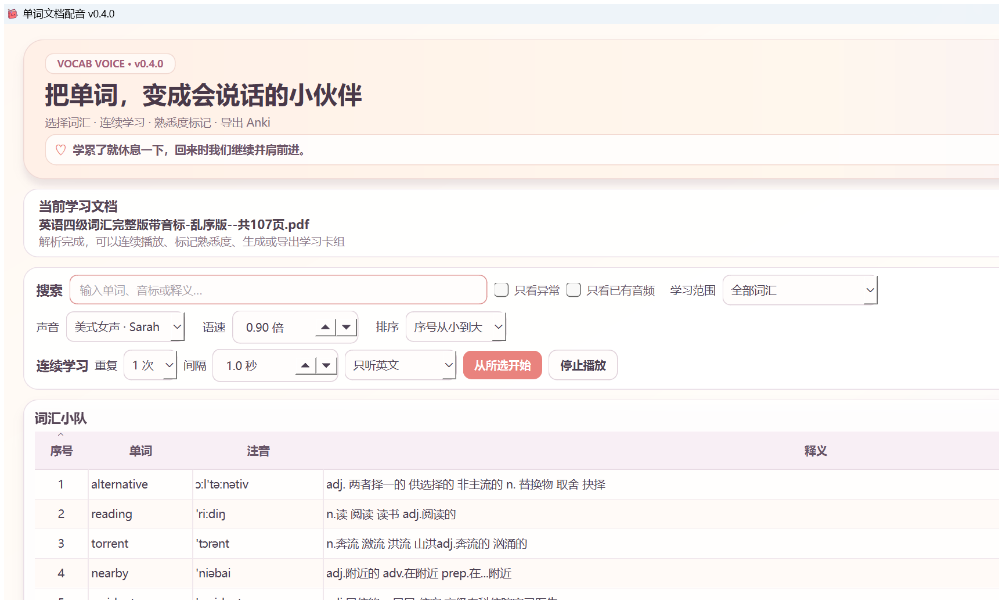

# v0.4.0 连续学习与个人贴纸场景

## 核心场景

学习者在词汇表中选中任意一行，设置重复 1—5 次、词间暂停 0—10 秒以及“只听英文”或“英文＋中文释义”，点击“从所选开始”。程序按当前排序和筛选后的表格顺序自动播放后续单词，并把正在播放的行滚动到可见区域。

学习者可以在播放过程中把当前词标记为“认识”“模糊”或“不认识”。下次把“学习范围”切换为“重点复习”后，只显示模糊和不认识的词，再从任意位置连续播放。

## 播放状态

- 准备：显示从所选开始、重复次数、间隔和内容模式。
- 播放：状态栏显示当前位置、总数、当前单词和第几次重复。
- 中文释义：英文重复结束后调用 Windows 离线中文语音；没有中文语音时提示并降级为只听英文。
- 暂停间隔：使用可中断等待，点击“停止播放”或“停止全部”立即结束队列。
- 单词失败：记录并跳过当前项，不让整个学习队列中断。

## 贴纸场景

- 顶部提供“换贴纸”和“＋我的贴纸”。
- 公开版只内置五枚原创学习贴纸，不包含商业动漫角色资源。
- 用户添加的 PNG、JPG、JPEG 或 WebP 复制到本机自定义贴纸目录，与内置贴纸共同轮换。
- 用户可以删除自己的贴纸，不能删除安装包中的内置原创贴纸。

## 数据保护场景

- 旧项目首次打开 v0.4.0 时，迁移前自动备份并增加 `learning_status`。
- 每天首次打开创建自动备份；重新分析、恢复前再创建保护性备份。
- “选择词汇 → 备份与恢复”可立即备份或恢复历史数据。
- 恢复完成后直接重新载入项目，并保持原 PDF 和 WAV 文件不变。

## 视觉验收重点

截图至少展示 v0.4.0 版本号、连续学习控制、三档熟悉度、重点复习入口、原创贴纸或“我的贴纸”入口，以及真实项目数据。只截应用窗口，不带入其他窗口或个人内容。

